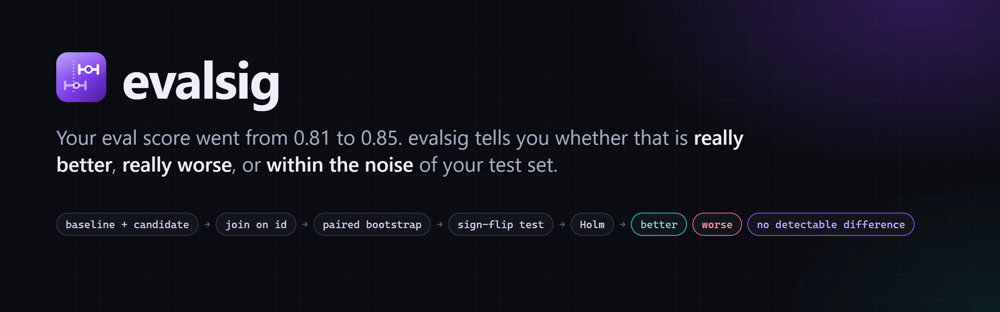
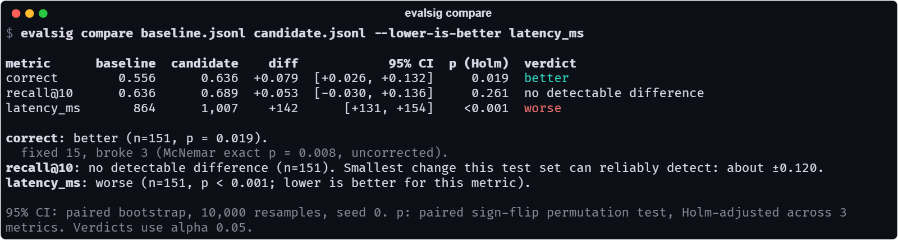
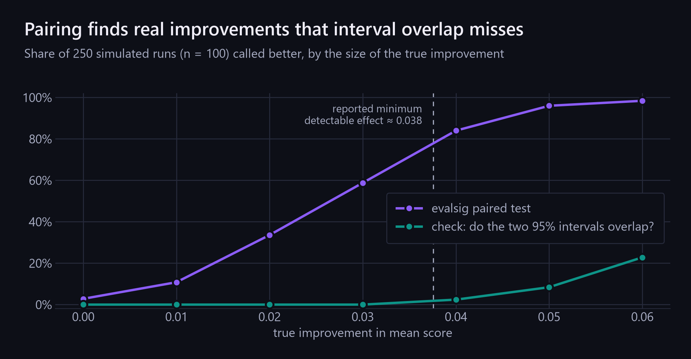
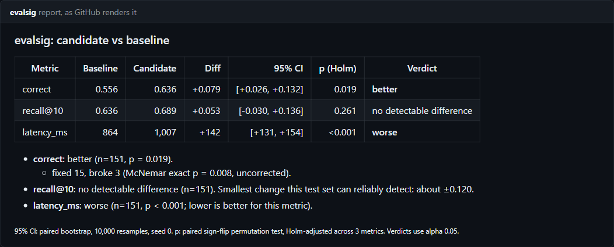
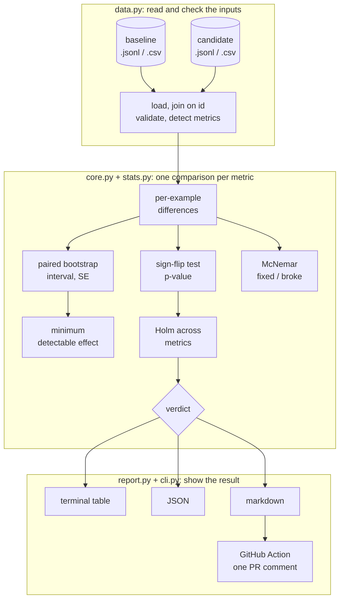
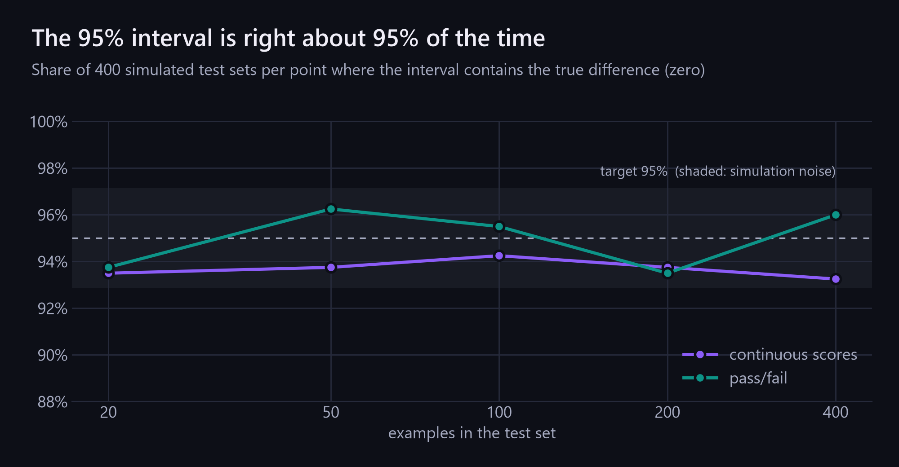
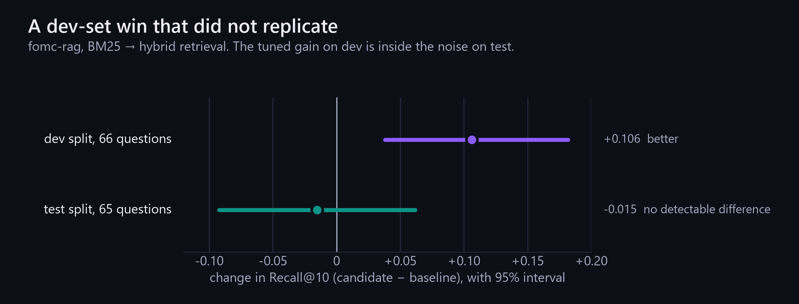

<p align="center">
  
</p>

<p align="center">
  <a href="https://github.com/ArjunShuklaCSE/evalsig/actions/workflows/ci.yml"></a>
  
  
  
  
  
  <a href="https://github.com/ArjunShuklaCSE/evalsig/releases/latest"></a>
  <a href="LICENSE"></a>
</p>

**evalsig** compares two runs of an AI evaluation (a baseline and a candidate, scored on the same test examples) and tells you whether the candidate is **better**, **worse**, or shows **no detectable difference**, with a confidence interval, a p-value, and the smallest change your test set could have detected.

It reads the per-example results that any eval tool already writes (promptfoo, Inspect, DeepEval or your own scripts). It does not run evals or call a model. It is a small, tested statistics layer: a CLI, a Python API and a GitHub Action that comments on pull requests.

<p align="center">
  
</p>

---

**Contents** · [Why](#why-evalsig) · [Quick start](#quick-start) · [Reading the result](#how-to-read-the-result) · [GitHub Action](#in-ci-the-github-action) · [Architecture](#architecture) · [The statistics](#the-statistics) · [A real example](#a-real-example-a-gain-that-did-not-replicate) · [Input format](#input-format) · [CLI](#command-line) · [Python API](#python-api) · [Limitations](#limitations) · [Docs](#documentation) · [Development](#development)

## Why evalsig

Eval test sets are small. A typical one has 50 to 500 questions, so a few lucky or unlucky questions move the score by several points. Most teams still decide by looking at the two averages, or by checking whether two error bars overlap. Both mislead:

- **Looking at averages** ships changes that are only noise. A +0.04 on 150 questions is often inside the range that chance alone produces.
- **Checking whether intervals overlap** misses real improvements. It ignores that both runs answered *the same* questions, which is the biggest source of shared noise.

<p align="center">
  
</p>

In this simulation (100 questions, skewed scores), a true improvement of 0.04 was detected in **84%** of runs by evalsig's paired test and in **2.4%** by the overlap check. The paired test also reports that ≈0.038 is the smallest improvement this test set can reliably detect. That figure tells you before you start whether your test set can answer the question at all.

What you get:

- **A verdict in plain English**, never "the same" or "no effect": absence of evidence is not evidence of absence.
- **Paired statistics throughout**: a paired bootstrap interval and an exact or Monte Carlo sign-flip permutation test.
- **For pass/fail metrics**, fixed and broke counts with McNemar's exact test.
- **Holm–Bonferroni correction** when you compare several metrics at once.
- **Cluster resampling** when several rows belong to one question (`group` column).
- **Lower-is-better metrics** such as latency and cost.
- **Deterministic output**: the same input and seed give byte-identical results.
- **CI-ready**: `--fail-on worse` exit codes, plus a GitHub Action that keeps one PR comment up to date.
- **Checked by simulation**, not just unit tests: 110 tests, including calibration runs.

## Quick start

```bash
pip install git+https://github.com/ArjunShuklaCSE/evalsig
evalsig compare baseline.jsonl candidate.jsonl
```

Each file has one row per test example: an `id` and one or more scores. Extra text columns are ignored.

```json
{"id": "q001", "correct": 0, "recall@10": 1.0, "latency_ms": 666}
{"id": "q002", "correct": 1, "recall@10": 0.0, "latency_ms": 907}
```

To run the example shown above (Python 3.10+):

```bash
git clone https://github.com/ArjunShuklaCSE/evalsig && cd evalsig
pip install .
evalsig compare examples/baseline.jsonl examples/candidate.jsonl --lower-is-better latency_ms
```

The example is a synthetic RAG system on 151 questions, before and after adding a reranker ([`examples/make_data.py`](examples/make_data.py)). `--format markdown` and `--format json` print the same result for pull requests and scripts.

> [!NOTE]
> evalsig is not on PyPI yet. Each [release](https://github.com/ArjunShuklaCSE/evalsig/releases/latest) has the wheel attached, and `pip install` works on it directly. On PyPI it will be published as `evalsig-stats` (the name `evalsig` is taken there). The import name and the command stay `evalsig`.

<details>
<summary>Text version of the output above</summary>

```
$ evalsig compare examples/baseline.jsonl examples/candidate.jsonl --lower-is-better latency_ms
metric      baseline  candidate    diff            95% CI  p (Holm)  verdict
correct        0.556      0.636  +0.079  [+0.026, +0.132]     0.019  better
recall@10      0.636      0.689  +0.053  [-0.030, +0.136]     0.261  no detectable difference
latency_ms       864      1,007    +142      [+131, +154]    <0.001  worse

correct: better (n=151, p = 0.019).
  fixed 15, broke 3 (McNemar exact p = 0.008, uncorrected).
recall@10: no detectable difference (n=151). Smallest change this test set can reliably detect: about ±0.120.
latency_ms: worse (n=151, p < 0.001; lower is better for this metric).

95% CI: paired bootstrap, 10,000 resamples, seed 0. p: paired sign-flip permutation test, Holm-adjusted across 3 metrics. Verdicts use alpha 0.05.
```

</details>

## How to read the result

| Column | What it means |
|---|---|
| **baseline / candidate** | The average score of each run over the examples both runs share. |
| **diff** | Candidate minus baseline. For `correct`, the candidate answered 7.9 percentage points more questions correctly. |
| **95% CI** | The range of true differences that fit the data. If it includes zero, as it does for `recall@10`, the data cannot rule out "no change". |
| **p** | How surprising a difference this large would be if the two runs were truly equal. With several metrics it is Holm-corrected, so checking more metrics does not raise the odds of a lucky "win". |
| **verdict** | **better** or **worse**: the difference is larger than luck explains (p < 0.05). **no detectable difference**: this test set cannot tell. It never means "the same". |

Under the table:

- **Smallest change this test set can reliably detect.** True differences smaller than this are usually missed. For `recall@10`, ±0.120 means 151 questions cannot settle whether retrieval improved by 0.05. You need more questions, or you have to accept that you don't know.
- **fixed / broke.** How many pass/fail examples flipped each way. A net +12 can hide a lot of churn, and the examples that broke are worth reading.
- **Notes.** evalsig flags anything that needs attention:
  - the two runs are identical,
  - fewer than 20 examples,
  - a result that is significant only before the multiple-metric correction,
  - a borderline case where the interval and the test disagree.

## In CI: the GitHub Action

evalsig ships as a composite GitHub Action. It compares the two result files, writes the report to the job summary, and posts **one** comment on the pull request. Later runs **update that comment** instead of adding new ones; the action finds it by a hidden `<!-- evalsig -->` marker.

<p align="center">
  
  <br><sub>The report the action posts, rendered by GitHub's markdown renderer from the example data.</sub>
</p>

```yaml
name: eval
on: pull_request

permissions:
  contents: read
  pull-requests: write   # to post the comment

jobs:
  eval:
    runs-on: ubuntu-latest
    steps:
      - uses: actions/checkout@v7
      - run: python run_my_evals.py --out results/candidate.jsonl   # your eval
      - uses: ArjunShuklaCSE/evalsig@v0.1.0
        with:
          baseline: results/baseline.jsonl     # committed results of the main branch
          candidate: results/candidate.jsonl
          metrics: correct recall@10 latency_ms
          lower-is-better: latency_ms
          fail-on: worse                        # optional: fail the check on a regression
```

| Input | Default | Meaning |
|---|---|---|
| `baseline`, `candidate` | required | Result files (`.jsonl` or `.csv`) |
| `metrics` | all numeric columns | Space- or comma-separated metric names |
| `lower-is-better` | none | Metrics where a decrease is an improvement |
| `fail-on` | none | `worse` or `not-better`; fails the job when met |
| `alpha` | `0.05` | Significance level |
| `allow-partial` | `false` | Compare only the ids present in both files |
| `comment` | `true` | Post or update the PR comment |
| `github-token` | `github.token` | Needs `pull-requests: write` |

The outputs are `failed` (`true` when the fail-on condition was met) and `report` (the path to the markdown file). The action runs on Linux and macOS runners. Fork pull requests get a read-only token, so posting the comment fails without failing the job, and the check itself still runs. This repository's own CI runs the action on every push ([`ci.yml`](.github/workflows/ci.yml)).

## Architecture



| Module | Responsibility |
|---|---|
| [`stats.py`](src/evalsig/stats.py) | Pure statistics on per-group sums: Wilson, bootstrap, sign-flip test, McNemar, Holm, MDE. No I/O. |
| [`core.py`](src/evalsig/core.py) | One comparison per metric, Holm across metrics, verdicts and notes, and the typed result dataclasses. |
| [`data.py`](src/evalsig/data.py) | Reading JSONL and CSV, joining on `id`, metric detection, groups, and every input error message. |
| [`report.py`](src/evalsig/report.py) | Plain-English sentences, the terminal table and the markdown report. |
| [`cli.py`](src/evalsig/cli.py) | The `evalsig` command (typer), output formats and exit codes. |
| [`action.yml`](action.yml) | The composite GitHub Action. |

Three design decisions shape the code:

1. **One code path for grouped and ungrouped data.** The statistics run on per-group sums, and ungrouped data is just one row per group. The cluster bootstrap and the plain bootstrap are the same function.
2. **Each metric gets its own seeded generator.** Adding or removing a metric never changes another metric's numbers.
3. **The core never imports the CLI stack.** `stats`, `core` and `data` depend only on numpy and scipy; typer and rich are used only for display.

## The statistics

| Question | Method |
|---|---|
| Pass rate of one run | Wilson score interval |
| Mean of one run | Bootstrap percentile interval |
| Difference between runs | Paired bootstrap over example ids (10,000 resamples) |
| Is the difference real? | Paired sign-flip permutation test (exact when small) |
| Pass/fail churn | Fixed and broke counts with McNemar's exact test |
| Several metrics at once | Holm–Bonferroni |
| Is my test set big enough? | Minimum detectable effect ≈ 2.8 × SE (80% power, α 0.05) |
| Several rows per question | Cluster bootstrap and cluster sign-flips over `group` |

Each method is checked by simulation as well as unit tests. With no true difference, the 95% interval should contain zero 95% of the time:

<p align="center">
  
</p>

Coverage stays within simulation noise of 95% from 20 to 400 examples. Continuous scores sit slightly under the target, at 93–94%, which is the known small-sample behaviour of the percentile bootstrap. The verdict comes from the permutation test, whose false-positive rate stayed between 2% and 5.3% across these simulations. Every method, why it was chosen over the alternatives, the validation tables and 14 references are in **[docs/statistics.md](docs/statistics.md)**.

## A real example: a gain that did not replicate

[fomc-rag](https://github.com/ArjunShuklaCSE/fomc-rag) is a retrieval system over Federal Reserve documents, tuned on a dev split and checked once on a held-out test split. One tuning step replaced BM25 retrieval (E8) with a weighted hybrid of BM25 and dense retrieval (E10). Its per-question results are in [`examples/fomc-rag/`](examples/fomc-rag).

<p align="center">
  
</p>

```
$ evalsig compare examples/fomc-rag/dev_E8.jsonl examples/fomc-rag/dev_E10.jsonl -m recall@10
metric     baseline  candidate    diff            95% CI      p  verdict
recall@10     0.333      0.439  +0.106  [+0.038, +0.182]  0.008  better
```

```
$ evalsig compare examples/fomc-rag/test_E8.jsonl examples/fomc-rag/test_E10.jsonl -m recall@10
metric     baseline  candidate    diff            95% CI      p  verdict
recall@10     0.385      0.369  -0.015  [-0.092, +0.062]  1.000  no detectable difference

recall@10: no detectable difference (n=65). Smallest change this test set can reliably detect: about ±0.114.
```

Two lessons, both visible in the output:

1. **A significant result on the data you tuned on is not a result.** The hybrid weight was picked from four candidates using these same 66 dev questions, so part of the +0.106 was the search fitting noise. evalsig cannot see that selection step, which is why a held-out split matters.
2. **The test split is too small to confirm the gain claimed on dev.** With 65 questions the smallest reliably detectable change is ±0.114, about the size of the whole dev effect. "No detectable difference" here means "this test set can't tell", not "fusion does nothing".

These intervals match the ones fomc-rag reports, which its own code computed separately.

## Input format

- **Files:** `.jsonl` (one JSON object per line) or `.csv` with a header row.
- **`id` (required):** identifies the example. The two runs are joined on `id`, not on row order, and ids must be unique within a file.
- **Metrics:** every other column whose values are all numbers is a metric. Text columns such as the model output are ignored, and `--metric` picks specific columns.
  - **Binary** metrics have only 0/1 or `true`/`false` values. They get Wilson intervals and McNemar's test.
  - **Continuous** metrics have any other numbers (scores, recall, latency).
  - Detection is automatic. `--metric-type score=continuous` overrides it.
- **`group` (optional):** marks rows that belong to the same question, for example 5 samples per prompt. Those rows are correlated, so evalsig resamples whole groups.
- **Mismatched ids** stop the comparison with an error that lists the missing ids. `--allow-partial` compares only the shared ids and prints a warning.
- **Missing values:** an empty cell, `null` or NaN stops with an error naming the affected ids. evalsig never drops examples silently, because dropping the failures would flatter a run.

## Command line

```
evalsig summary RUN [options]
evalsig compare BASELINE CANDIDATE [options]
```

| Option | Default | Meaning |
|---|---|---|
| `-m`, `--metric NAME` | all numeric columns | Metric to analyse. Repeat for several. |
| `--metric-type NAME=TYPE` | auto | Force `binary` or `continuous`. |
| `--lower-is-better NAME` | none | A decrease is an improvement (latency, cost, error rate). `compare` only. |
| `--alpha` | `0.05` | Significance level. Intervals are (1 − alpha) confidence. |
| `--resamples` | `10000` | Bootstrap and permutation resamples. |
| `--seed` | `0` | Random seed. The same input and seed give exactly the same output. |
| `-f`, `--format` | `table` | `table`, `json` or `markdown`. |
| `--fail-on` | none | `worse`: exit 1 if any metric is worse. `not-better`: exit 1 unless every metric is better. `compare` only. |
| `--allow-partial` | off | Compare only the ids present in both runs. `compare` only. |

Exit codes: **0** success, **1** the `--fail-on` condition was met, **2** invalid input (the message says what to fix, never a traceback). `evalsig summary` reports each metric's mean for one run with a 95% interval: Wilson for pass rates, a bootstrap for everything else.

## Python API

```python
from evalsig import compare, load_rows

result = compare(
    load_rows("baseline.jsonl"),  # or any list of dicts
    load_rows("candidate.jsonl"),
    metrics=["correct", "latency_ms"],
    lower_is_better=["latency_ms"],
)
for m in result.metrics:
    print(m.metric, m.diff, (m.ci_low, m.ci_high), m.p_adjusted, m.verdict, m.mde)

result.to_dict()  # plain dict
result.to_json()  # JSON string
```

`compare` returns a frozen `Comparison` dataclass with one `MetricComparison` per metric. `summarize` does the same for a single run. Invalid input raises `evalsig.EvalsigError`, whose message is written to be shown to a user. If your scores are already aligned arrays, `compare_arrays` and `summarize_arrays` skip the row handling.

## Limitations

- **It cannot see how you chose the candidate.** If you tried twenty prompts and compare the best one, its p-value is too optimistic. Confirm on data you did not tune on, as in the [fomc-rag example](#a-real-example-a-gain-that-did-not-replicate).
- **The test set stands in for the inputs you care about.** The intervals describe uncertainty over examples like these. A test set of easy questions says little about hard ones.
- **Small samples.** Below about 20 examples or groups the bootstrap intervals are too narrow, and evalsig says so. With 25 groups, the 95% interval covered about 92% of the time in simulation. The permutation test, which decides the verdict, stays exact.
- **Judge noise.** If an LLM judge produced the scores, its randomness and bias are inside the data. evalsig measures sampling uncertainty over examples, not judge error.
- **No equivalence test.** "No detectable difference" is never a claim that two systems are equal. Showing equivalence needs a test against a margin set in advance (TOST), which v0.1 does not include.
- **Higher is better by default.** Pass `--lower-is-better` for latency, cost and error rates, or their verdicts are reversed.

## Documentation

| Document | Contents |
|---|---|
| [docs/statistics.md](docs/statistics.md) | Every method, why it was chosen, validation results, references |
| [CHANGELOG.md](CHANGELOG.md) | Release notes |
| [CONTRIBUTING.md](CONTRIBUTING.md) | Setup, checks, and how to change the statistics safely |
| [examples/](examples) | Synthetic example data, the fomc-rag results and a script that reproduces this README |
| [docs/images/src/](docs/images/src) | Sources for every figure in this README |

## Development

```bash
uv sync
uv run pytest -q                                     # unit, property-based and calibration tests
uv run ruff check . && uv run ruff format --check .
uv run mypy                                          # strict, on src/
uv run docs/images/src/figures.py                    # re-render the README figures
```

A test checks that every `$ evalsig` example in this README still matches the tool's real output. Pushing a `v*` tag runs the tests, builds the package and creates a GitHub release with notes from the changelog. Once the repository variable `PUBLISH_TO_PYPI` is `true`, the same workflow publishes to PyPI through trusted publishing (no token stored in the repository).

## License

MIT. The fomc-rag example data comes from [fomc-rag](https://github.com/ArjunShuklaCSE/fomc-rag) (MIT).
